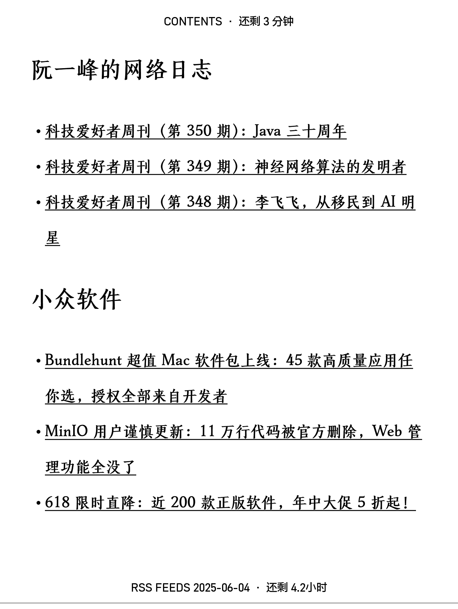

# Kobo eReader RSS converter 

Kobo eReader RSS feed collection to ePub script

[中文](./doc/README-zh_cn.md)



## Installation

### 1. Install NickelMenu

Refer to [here](https://pgaskin.net/NickelMenu/#install).

### 2. Download and copy the rss.py script

Click [here](https://github.com/IcingTomato/Kobo-RSS/releases/latest) to download the latest version of `Kobo-RSS_xxxx.zip`.

Extract the downloaded `Kobo-RSS_xxxx.zip` and copy the `.adds` folder *completely* to the *root directory* of your Kobo eReader.

### 3. Install Python 3

Refer to [here](https://www.mobileread.com/forums/showthread.php?t=254214) for installation. Click here to [download](https://storage.gra.cloud.ovh.net/v1/AUTH_2ac4bfee353948ec8ea7fd1710574097/mr-public/Kobo/kobo-stuff-1.6.N-r18901.tar.xz).

This version of Python is Python 3.9, which can run without updates.

If you need to update, use Telnet to connect to your Kobo eReader and run the following command (you can enable Telnet in NickelMenu first):

```ash
tmux new -s kobo update-kobostuff Python
```

The default username and password for Kobo eReader are both `admin`.

> My Kobo eReader is Libra Colour, and the upgrade program cannot run properly.

Then run the following commands in Telnet:

```ash
echo 'export PATH=$PATH:/mnt/onboard/.niluje/python3/bin' >> /etc/profile
source /etc/profile
```

### 4. Install pip

Please run the following commands:

```ash
cd /mnt/onboard/.adds/rss/
wget https://bootstrap.pypa.io/get-pip.py
python get-pip.py
```

### 5. Install dependencies

Please run the following commands:

```ash
cd /mnt/onboard/.adds/rss/
pip install -r requirements.txt
```

### 6. Restart Kobo eReader

Please restart your Kobo eReader for the changes to take effect.

## Usage

> It is recommended to enable developer mode on your Kobo eReader first. Refer to [here](https://wiki.mobileread.com/wiki/Kobo_eReader_hacks#devmode).
> After enabling developer mode, it is recommended to turn on the `Force WiFi On` option to maintain WiFi connection while the script is running.

1. Turn on WiFi and connect to the network.
2. In NickelMenu, click `Get My RSS` to run.
3. If you need to know the script's running status, click `Check RSS Status` in NickelMenu. When the script is running, the dialog will show `rss.py is running.`, otherwise it will show `rss.py is idle.`.
4. Make sure to click `Check RSS Status` and confirm the dialog shows `idle` status, then click `Import new book` to reload the book list.
5. In the book list, you will see the `RSS Feeds %Y-%M-%D` book. Click to read.

## `rss/config` Configuration File

In the `/mnt/onboard/.adds/rss/` directory, you can find the `config` file. This file contains the RSS feed configuration.

You can edit this file to add or remove RSS feeds. Each link takes one line, in the format:

```
#https://icing.fun/atom.xml  # Comment line, will not be processed
https://coolshell.cn/feed    # Valid link
```

Please note that links must be valid RSS feeds, and each link must be on a separate line.

## Verified Devices

- [x] Kobo Libra Colour

## Feedback and Issues

If you encounter problems during use or have any suggestions, please submit feedback at [GitHub Issues](https://github.com/IcingTomato/Kobo-RSS/issues).

## License

This project is licensed under the [MIT License](https://opensource.org/license/mit/). You are free to use, modify, and distribute the code of this project, but please retain the original author's copyright notice and license information.

## Contributing

Contributions of any form are welcome, including reporting issues, submitting code, or improving documentation. Please submit your suggestions or issues at [GitHub Issues](https://github.com/IcingTomato/Kobo-RSS/issues).

## Disclaimer

This project is for learning and research purposes only. The author is not responsible for any direct or indirect losses caused by using this project. Please ensure you understand relevant laws and regulations before use, and comply with local legal requirements.

## Changelog

Please refer to the [CHANGELOG.md](./doc/CHANGELOG.md) file for the latest changelog.

## TODO

- [ ] Move to Google App Engine(GAE).