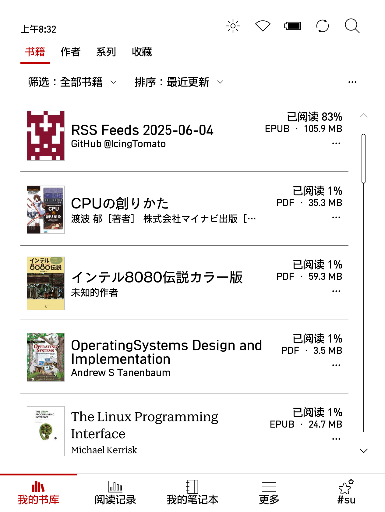

# Kobo eReader RSS converter 

Kobo eReader RSS 链接集合转 ePub 脚本



## 安装

### 1. 安装 NickelMenu

参见[此处](https://pgaskin.net/NickelMenu/#install)。

### 2. 下载并复制 rss.py 脚本

点击[此处](https://github.com/IcingTomato/Kobo-RSS/releases/latest)下载最新版本的 `Kobo-RSS_xxxx.zip`。

将下载的 `Kobo-RSS_xxxx.zip` 解压缩，将 `.adds` 文件夹*完整*复制到 Kobo eReader 的 *根目录*下。

### 3. 安装 Python 3

参见[此处](https://www.mobileread.com/forums/showthread.php?t=254214)进行安装。点击此处[下载](https://storage.gra.cloud.ovh.net/v1/AUTH_2ac4bfee353948ec8ea7fd1710574097/mr-public/Kobo/kobo-stuff-1.6.N-r18901.tar.xz)。

该版本的 Python 是 Python 3.9，无需更新即可运行。

如果需要更新，使用 Telnet 连接到 Kobo eReader，运行以下命令（可以先在 NickelMenu 开启 Telnet）：

```ash
tmux new -s kobo update-kobostuff Python
```

Kobo eReader 的默认用户名和密码皆为 `admin`。

> 我的 Kobo eReader 是 Libra Colour，升级程序无法正常运行。

接着在 Telnet 中运行以下命令：

```ash
echo 'export PATH=$PATH:/mnt/onboard/.niluje/python3/bin' >> /etc/profile
source /etc/profile
```

### 4. 安装 pip

请运行以下命令：

```ash
cd /mnt/onboard/.adds/rss/
wget https://bootstrap.pypa.io/get-pip.py
python get-pip.py
```

### 5. 安装依赖

请运行以下命令：

```ash
cd /mnt/onboard/.adds/rss/
pip install -r requirements.txt
```

### 6. 重启 Kobo eReader

请重启 Kobo eReader 以使更改生效。

## 使用

> 建议先启用 Kobo eReader 的开发者模式。参见[此处](https://wiki.mobileread.com/wiki/Kobo_eReader_hacks#devmode)。
> 启用开发者模式后，建议您开启 `Force WiFi On` 选项，以便在脚本运行时保持 WiFi 连接。

1. 开启 WiFi，并连接到网络。
2. 在 NickelMenu 中，点击 `Get My RSS` 以运行。
3. 如果您需要知道脚本的运行状态，请在 NickelMenu 中点击 `Check RSS Status`。当脚本运行时，对话框会提示您 `rss.py is running.`，否则会提示 `rss.py is idle.`。
4. 确保点击 `Check RSS Status` 后对话框提示 `idle` 状态时，点击 `Import new book` 以重新加载书籍清单。
5. 在书籍列表中，您会看到 `RSS Feeds %Y-%M-%D` 书籍。点击即可阅读。

## `rss/config` 配置文件

在 `/mnt/onboard/.adds/rss/` 目录下，您可以找到 `config` 文件。该文件包含了 RSS 链接的配置。

您可以编辑该文件，添加或删除 RSS 链接。每个链接占一行，格式为：

```
#https://icing.fun/atom.xml  # 注释行，不会被处理
https://coolshell.cn/feed    # 有效链接
```

请注意，链接必须是有效的 RSS 链接，并且每个链接必须单独占一行。

## 验证过的设备

-[x] Kobo Libra Colour

## 反馈和问题

如果您在使用过程中遇到问题或有任何建议，请在 [GitHub Issues](https://github.com/IcingTomato/Kobo-RSS/issues) 提交反馈。

## 许可证

本项目采用 [MIT 许可证](https://opensource.org/license/mit/)。您可以自由使用、修改和分发本项目的代码，但请保留原作者的版权声明和许可证信息。

## 贡献

欢迎任何形式的贡献，包括报告问题、提交代码或改进文档。请在 [GitHub Issues](https://github.com/IcingTomato/Kobo-RSS/issues) 提交您的建议或问题。

## 免责声明

本项目仅供学习和研究使用。作者不对因使用本项目而导致的任何直接或间接损失承担责任。请在使用前确保您已了解相关法律法规，并遵守当地的法律要求。

## 更新日志

请参见 [CHANGELOG.md](CHANGELOG.md) 文件以获取最新的更新日志。
